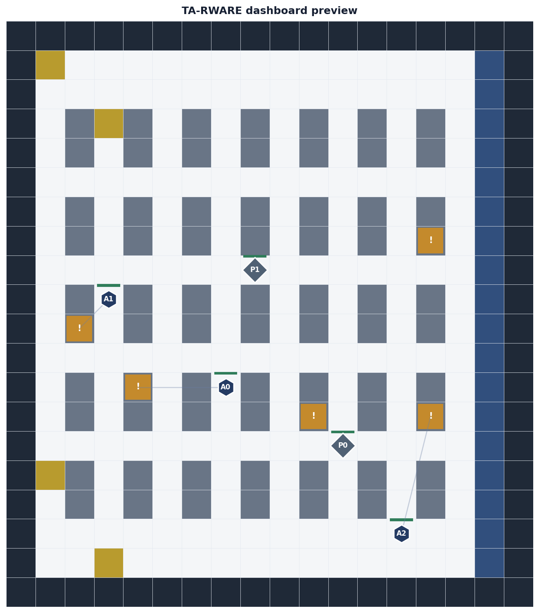

# TA-RWARE Warehouse RL Dashboard

TA-RWARE is a multi-agent reinforcement learning project for warehouse task allocation and routing. AGVs navigate to racks, deliver orders to goal docks, manage battery constraints, and coordinate with picker agents inside a grid warehouse environment.



## Features

- Multi-agent warehouse environment with AGVs, pickers, racks, goals, chargers, orders, and battery dynamics.
- Dueling DQN agents with saved checkpoints.
- Greedy and random baseline policies.
- Streamlit dashboard for interactive simulation.
- Parameter tuning from the sidebar with visible progress bars.
- Animated environment view showing agents moving through the warehouse.
- Deterministic policy comparison for DQN, greedy, and random policies.
- Saved training metrics and plot artifacts.

## Setup

Create or activate the project virtual environment, then install dependencies:

```powershell
venv\Scripts\python.exe -m pip install -r requirements.txt
```

## Run The Dashboard

For presentation/demo use:

```powershell
.\run_demo.bat
```

This uses the existing trained checkpoints in `models/` and opens the Streamlit dashboard. Use the `Run` tab to show agents moving and the `Compare policies` tab to show DQN vs greedy vs random evaluation.

```powershell
venv\Scripts\streamlit.exe run streamlit_app.py
```

Or use the Windows launcher:

```powershell
.\run_streamlit.bat
```

Open the local URL printed by Streamlit, usually:

```text
http://localhost:8501
```

## Dashboard Workflow

1. Select a model directory and fallback config in the sidebar.
2. Tune environment, battery, and reward parameters.
3. Choose `DQN`, `Greedy`, or `Random`.
4. Run a single animated simulation from the `Run` tab.
5. Use `Compare policies` to evaluate all policies over the same deterministic seeds.
6. Inspect saved training metrics and plot artifacts from the `Saved plots` tab.

## Training

Train with the default configuration:

```powershell
venv\Scripts\python.exe train.py --config configs\config.yaml
```

Use the smoke config for a quick verification run:

```powershell
venv\Scripts\python.exe train.py --config configs\config.smoke.yaml --run_name smoke_verify
```

## Evaluation

Evaluate a trained DQN policy:

```powershell
venv\Scripts\python.exe evaluate.py --model_dir models --config configs\config.yaml --episodes 10 --policy dqn
```

Compare DQN with baselines:

```powershell
venv\Scripts\python.exe evaluate.py --model_dir models --config configs\config.yaml --episodes 10 --compare
```

## Key Metrics

- Average reward
- Deliveries completed
- Completion rate
- Throughput per 100 steps
- Collision count
- Charge visits
- Average order cycle time

## Project Structure

```text
agents/              DQN, replay buffer, network, and baseline policies
configs/             Training and smoke-test YAML configs
envs/                Warehouse environment
logs/                Training metrics and generated plots
models/              Saved checkpoints
utils/               Logging, visualization, and experiment helpers
streamlit_app.py     Interactive dashboard
train.py             Training entry point
evaluate.py          Evaluation and policy comparison entry point
```

## Notes

The dashboard can only load DQN checkpoints when the selected environment and agent parameters match the checkpoint architecture. If you change parameters such as agent count or observation shape, the dashboard will still run, but DQN actions may fall back to the greedy baseline.
